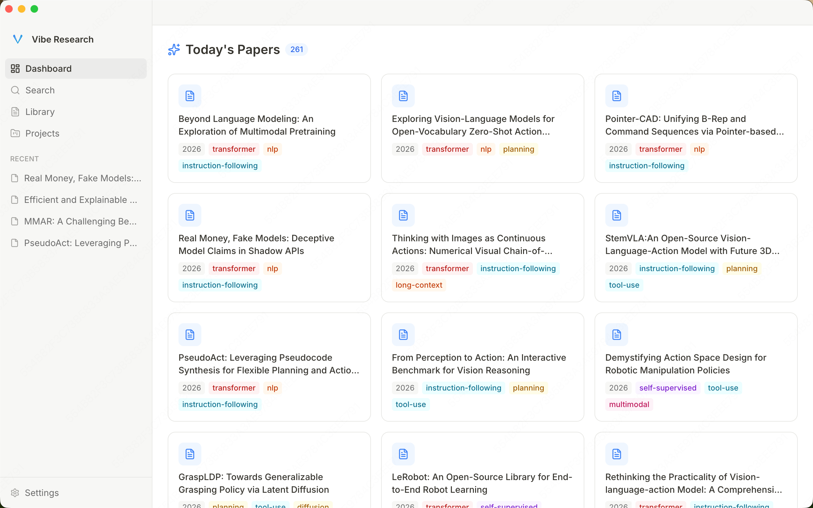

<p align="center">
  
</p>

<h1 align="center">ResearchClaw</h1>

<p align="center">
  <strong>AI-Powered Research Desktop App</strong>
</p>

<p align="center">
  Literature management, smart reading notes, and research idea generation — all in one native app
</p>

<p align="center">
  <a href="https://github.com/Noietch/ResearchClaw/stargazers"></a>
  <a href="LICENSE"></a>
  <a href="https://github.com/Noietch/ResearchClaw/pulls"></a>
  <a href="README_CN.md"></a>
</p>

---

## What is ResearchClaw?

**ResearchClaw** is a standalone **Electron desktop app** for researchers. It combines AI-powered paper management, interactive reading, and idea generation in a clean interface — no browser, no server, no plugin required.

## Screenshot



_Dashboard showing today's papers with AI-generated tags (transformer, nlp, planning, instruction-following, etc.)_

## Key Features

| Feature               | Description                                                                              |
| :-------------------- | :--------------------------------------------------------------------------------------- |
| **Dashboard**         | Browse today's arXiv papers with AI-categorized tags at a glance                         |
| **Paper Import**      | Batch import from Chrome history, or download single papers by arXiv ID/URL              |
| **AI Reading**        | Open PDFs with side-by-side chat; AI fills structured reading cards                      |
| **Note Editing**      | Rich-text editor with Vibe (AI) / Manual mode toggle                                     |
| **Multi-Layer Tags**  | Auto-tag papers by domain / method / topic; manage tags with batch operations            |
| **Library**           | Filter papers by category, tag, year; search across title and abstract                   |
| **Projects**          | Organize papers and repos into research projects; generate AI ideas from your collection |
| **Agentic Search**    | AI autonomously searches your library using multi-step tool calling                      |
| **Token Usage**       | Track API usage with animated line charts and GitHub-style activity heatmap              |
| **Multi-Provider AI** | Configure Anthropic, OpenAI, Gemini, or any OpenAI-compatible API                        |
| **CLI Tools**         | Run Claude Code, Codex, or Gemini CLI directly inside the app                            |
| **Proxy Support**     | HTTP/SOCKS proxy for downloads and API calls (useful in restricted networks)             |

## Requirements

- macOS 12+ (arm64 / x64), Windows 10+ (x64 / arm64), or Linux (x64 / arm64)
- Node.js >= 18 (for building from source)

## Quick Start

```bash
# Clone and install
git clone https://github.com/Noietch/ResearchClaw.git
cd ResearchClaw
npm install

# Development mode
npm run dev

# Build and package
npm run release:mac    # macOS → .dmg (arm64 + x64)
npm run release:win    # Windows → NSIS installer (x64 + arm64)
npm run release:linux  # Linux → AppImage (x64 + arm64)
```

## Model Setup (Built-in Semantic Search)

The ONNX model weights for built-in semantic search (`all-MiniLM-L6-v2`, ~86 MB) are **not bundled in the repository**. You have two options:

**Option 1 — Download via Settings UI (recommended)**

Open the app → Settings → Semantic Search → click the built-in embedding card → click "Download Model (~86 MB)". The model downloads to `~/.researchclaw/models/` and persists across app updates.

**Option 2 — Download via script (for development)**

```bash
bash scripts/download-model.sh
```

This places the model files under `models/Xenova/all-MiniLM-L6-v2/` in the project root (ignored by git).

> **Note for CI / release builds**: Run `scripts/download-model.sh` before `npm run release:*` so the model is included in the packaged app's `extraResources`.

## Architecture

```
src/
  main/       # Electron main process (IPC handlers, services, stores)
  renderer/   # Vite + React UI
  shared/     # Shared types, utils, prompts
  db/         # Prisma + SQLite repositories
prisma/       # schema.prisma
tests/        # Integration tests (service layer)
scripts/      # build-main.mjs, build-release.sh
```

- **Database**: SQLite via Prisma at `~/.researchclaw/researchclaw.db`
- **AI**: Vercel AI SDK supporting Anthropic, OpenAI, Gemini, and OpenAI-compatible providers
- **Build**: esbuild (main process) + Vite (renderer)

## License

[CC BY-NC 4.0](LICENSE) — Free for non-commercial use. Attribution required. Commercial use is not permitted.

## Star History

<a href="https://star-history.com/#Noietch/VibeResearch&Date">
 <picture>
   <source media="(prefers-color-scheme: dark)" srcset="https://api.star-history.com/svg?repos=Noietch/VibeResearch&type=Date&theme=dark" />
   <source media="(prefers-color-scheme: light)" srcset="https://api.star-history.com/svg?repos=Noietch/VibeResearch&type=Date" />
   
 </picture>
</a>

---

<p align="center">
  Built with ❤️ for the research community.
</p>
